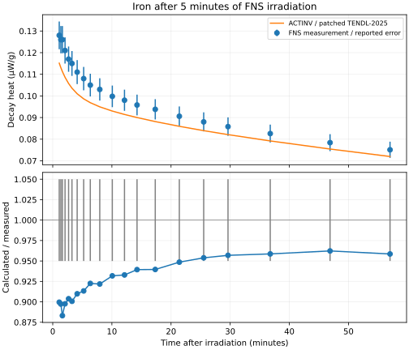

# FNS iron: predict measured decay heat after neutron exposure

This example runs ACTINV's CLI against a real experiment: the JAEA Fusion
Neutron Source's 1996 five-minute irradiation of iron. It compares predicted
decay heat with all twenty published measurements from 1.10 to 57.02 minutes
after irradiation. The practical question is how much decay heat remains in
an activated material as it cools.

The source package supplies the neutron spectrum, material/irradiation input,
measurements, and a plot identifying the units. ACTINV supplies publicly
downloadable, hash-pinned activation and decay data. No unpublished geometry
or inferred reaction rate is needed for this prescribed-spectrum inventory
benchmark. It does not independently reconstruct the experiment's transport
field or predict an entire component's temperature.

## Run it

Run from the repository root. On this Linux workstation, first check that
other solver/build workloads permit the run and inspect the bounded scope's
cgroup limits as required by `AGENTS.md`. Temporary files belong on disk:

```sh
mkdir -p target/preflight-tmp
bounded() {
  systemd-run --user --scope -p MemoryMax=6G -p MemorySwapMax=0 -p TasksMax=128 -p CPUQuota=200% -- env CARGO_BUILD_JOBS=1 RUST_TEST_THREADS=1 RAYON_NUM_THREADS=2 TMPDIR="$PWD/target/preflight-tmp" "$@"
}
bounded bash -c 'cg=$(sed -n "s/^0:://p" /proc/self/cgroup); for f in memory.max memory.swap.max pids.max cpu.max; do cat "/sys/fs/cgroup$cg/$f"; done'
```

Expected limits are `6442450944`, `0`, `128`, and `200000 100000`.
Stop if they are not enforced. Then run the following sequentially:

```sh
bounded cargo build --release -p actinv-cli --bin actinv
bounded target/release/actinv data fetch --output target/fns-data
bounded python3 controls/fns_iron.py --data-root target/fns-data
bounded python3 controls/test_fns_iron.py
```

The runner downloads the approximately 15 MiB CoNDERC archive if absent and
checks its hash before reading only four named members. `actinv data fetch`
downloads and verifies the released activation/decay bundle separately.
Existing correct downloads are reused. No nuclear libraries are stored in Git.

The numerical runner needs only Python's standard library. Add `--plot` to
generate an SVG if Matplotlib is installed in your Python environment. The
checked-in plot does not require Matplotlib to view. On hosted CI these jobs
run directly in the isolated runner; `.github/workflows/fns-iron.yml` is the
complete automated recipe.

Fresh outputs appear in `target/fns-iron/run/`:

- `spec.json`: the actual ACTINV problem, including verified local data paths.
- `cli.json` and `cli.log`: untouched CLI output and captured process log.
- `comparison.json`, `.csv`, `.md`: provenance, certificate/ledger, all
  predictions and measurements, and independently recalculated statistics.
- `comparison.svg`: optional plot with reported experimental error bars.
- The four hash-verified source members, including the original input and plot.

The generated `spec.json` can also be passed directly to `actinv run`.
`--archive`, `--data-root`, `--actinv`, and `--output` select alternative
locations. Numerical-library identities stay fixed. `--record` is for the
first evidence generation only and refuses to overwrite the committed receipt.

## What is compared

The normalized model is one gram of natural iron irradiated for 300 seconds
at 1.116e10 neutrons/cm²/s. The 709-group source spectrum is checked against
the original file; ACTINV normalizes its shape to the deck's declared total
flux. Cooling has zero flux. Density is not an input to this per-gram,
prescribed-spectrum calculation; no new self-shielding calculation is added.

The measurement file's first column is **minutes after irradiation**, confirmed
by its accompanying plot. The existing FISPACT deck rounds endpoints to whole
seconds. This runner uses the printed measurement times exactly, converts
them to seconds with decimal arithmetic, and constructs incremental cooling
steps. It checks the CLI's absolute times against `300 s + cooling time`.
No time-axis shift, interpolation, fitted normalization, or exclusions occur.

ACTINV emits W/g; the comparison uses µW/g, multiplying by exactly one million.
Every point records calculated/measured (C/E), signed relative difference,
and residual divided by the published error magnitude. The third measurement
column is labeled **reported error**: its confidence level and covariance are
not assumed. Error bars on the plot describe measurements, not model uncertainty.

Data: default ACTINV `data-v1.1.0` bundle, with the documented Avila Labs
remediation derivative of TENDL-2025, ENDF/B-VIII.0 decay, and JEFF-3.3 fallback.
This is not an identical-data comparison with the archive's FISPACT-II/TENDL-2017
reference. A C/E difference combines model, nuclear-data, and experimental
effects; it does not isolate solver error or establish a code ranking.

## Evidence and scope

The first fresh CLI run completed successfully on GitHub. The geometric-mean
calculated/measured ratio is **0.9263**, with pointwise ratios **0.8831–0.9623**.
ACTINV underpredicts all twenty measurements by **3.77–11.69%**; **5/20**
predictions lie inside the reported error bars. This is a documented systematic
difference, not a passed experimental-accuracy gate. The
[technical note](../../results/fns-iron-001/note.md) explains the result and its limits.



The [frozen protocol](../../protocols/FNS-IRON-001.md) and [case metadata](case.json)
precede fresh execution. See the [recorded comparison](../../results/fns-iron-001/comparison.md)
and [machine-readable receipt](../../results/fns-iron-001/comparison.json).
The CI artifact retains the raw CLI output and generated input for inspection.

This case was already used in ACTINV's larger FNS validation work. Packaging
it as an accessible application does not turn it into a new held-out test.
Successful CI means the documented execution and regression checks passed;
experimental agreement is reported without an acceptance gate. Conclusions
apply to iron, this irradiation, this cooling window, and decay heat only.

Source: [IAEA CoNDERC](https://www-nds.iaea.org/conderc/),
[FNS archive](https://www-nds.iaea.org/conderc/fusion/files/fns.zip).
Dataset source terms apply separately from ACTINV's software license. Archive,
member, catalog, data, executable, and generated-output hashes identify the
exact artifacts used.
