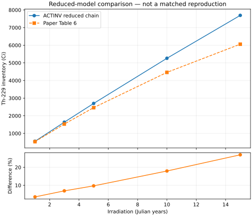

# Fusion Isotope Benchmark 001 — reduced-chain result

ACTINV's CRAM core passes the frozen reduced-chain numerical checks. The
reduced model overpredicts the paper's Th-229 inventory, increasingly with
irradiation duration. **This is not a matched reproduction of the paper.**

## Executed evidence

Inputs and tolerances were committed in `49683743fa43b016b4deee1ea7c0f7babe8d7a9e`
before execution. The first recorded run used implementation commit
`710969ce1163d9e92f7581a1d9ed03b423d3b669` in
[GitHub Actions run 35368517712](https://github.com/AvilaLabs/ACTINV/actions/runs/35368517712).
The hosted runner built the existing `cram_probe` in release mode with Rust
1.98.1; no workstation solver/build job was started because other simulations
were active. The receipt records the executable, source, protocol, case, and
coefficient SHA-256 identities. It was downloaded unchanged from that run.

The run passed all nine regression tests and all numerical comparisons:

- Seven irradiation checkpoints and five cooling checkpoints agree with the
  independent 80-digit closed-form Bateman control.
- Largest state error divided by its predeclared allowance: **0.008969**.
  The allowance is `1e6 atoms + 1e-9 * abs(analytic atoms)` for each state.
- Maximum relative conservation error: **7.64e-16** of the initial feed.
- Largest full-versus-two-half-step error divided by allowance: **0.004510**.

The absolute floor matters for early, small sink populations. These statistics
are numerical accuracy measures, not nuclear-data uncertainties. The sink
counts one heavy lineage per Ac-225 decay; it does not model the subsequent
decay chain or count emitted alpha particles.

## Literature comparison

The publication values are the direct Th-230 row in
[Table 6 of arXiv:2609.19166v1](https://arxiv.org/html/2609.19166v1).
No output-based rate fitting, source correction, or tolerance selection was
performed. The published yield is an input to this reduced calculation, so
this does not independently verify the neutron transport yield.

| Irradiation (years) | Paper Th-229 (Ci) | Reduced model (Ci) | Difference |
| ---: | ---: | ---: | ---: |
| 1 | 532 | 550.92 | +3.56% |
| 3 | 1,530 | 1,635.81 | +6.92% |
| 5 | 2,460 | 2,698.49 | +9.69% |
| 10 | 4,460 | 5,260.91 | +17.96% |
| 15 | 6,060 | 7,694.07 | +26.96% |

The differences far exceed the numerical solver error. They establish that
this particular reduced model does not recover the paper's tabulated history.
They do not establish an error in either ACTINV or the paper. Possible
contributors include omitted target destruction, product neutron losses,
composition/spectrum feedback, or different source normalization. We cannot
assign the discrepancy to one cause without the original rates and model.
The opening arithmetic already found a separate 2.17% residual between the
printed yield/source inputs and Table 2's gross annual production.

## Practical stopping point

The useful result is a runnable, externally anchored solver verification
case and an explicit measure of the reduced model's limits. The next step
toward matched reproduction is obtaining the Table 2/Figure 4 transport and
inventory inputs, including complete reaction rates and nuclear-data
provenance. More sweeps of guessed missing inputs would not resolve those
ambiguities. No harvesting optimization or clinical output claim is made.

Original G0/G1 receipts remain unchanged. This amendment verifies a reduced
G2 core-solver case; original matched-data G2/G3 remain pending. See the
[example documentation](../../examples/fusion_medical_isotopes/ac225/README.md)
for assumptions, references, commands, and reproducibility limits.
